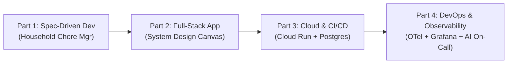

# AI Dev Tools Zoomcamp — Engineering Monorepo

> **Autonomous AI-Native Engineering, Production Deployments, and Self-Healing Observability**  
> *Course by [DataTalks.Club](https://datatalks.Club) | Developed & Maintained by [Sandy Boniface](https://github.com/SPBONIFACE)*

[](#repository-structure)
[](#technologies)
[](#technologies)
[](#technologies)
[](#cloud-architecture)
[](#cloud-architecture)
[](#part-4--devops-and-observability)

---

## Overview

This repository consolidates the complete coursework, engineering prototypes, cloud infrastructure, and autonomous agent systems developed throughout the **AI Dev Tools Zoomcamp** (2026).

Rather than isolated homework exercises, the repository traces the evolution of software development in the age of AI coding assistants: from **spec-driven requirements engineering** and **full-stack application assembly** to **zero-cost serverless cloud operations** and **autonomous, self-healing incident responders**.



---

## Repository Structure

```
ai-dev-tools-zoomcamp/
├── README.md                                # Master course portfolio & navigation
├── .gitignore                               # Monorepo ignore rules
│
├── part1-ai-native-development/             # Week 1: Spec-Driven Framework & Agent Loop
│   ├── chore_manager/                       # Django core configuration
│   ├── chores/                              # Allocation engine, LLM engine & mock fallback
│   ├── _docs/                               # Specifications, plan.md & groomed issues
│   └── scripts/                             # Autonomous issue sync & task automation
│
├── part2-build-and-ship-fullstack-app/      # Week 2: Interactive Real-Time Canvas
│   ├── frontend/                            # React + Vite whiteboard canvas UI
│   ├── backend/                             # FastAPI + WebSockets + SQLAlchemy
│   ├── openapi.yaml                         # Contract-first API schema
│   └── Makefile                             # Local development targets
│
├── part3-deploy-fullstack-app/              # Week 3: Production Cloud & Testing
│   ├── Dockerfile                           # Optimized multi-stage build (Node + Python)
│   ├── docker-compose.yaml                  # Local PostgreSQL + App stack
│   ├── e2e/                                 # Playwright dual-browser concurrency tests
│   └── .github/workflows/deploy.yml         # GitHub Actions CI/CD (GCP Workload Identity)
│
├── part4-devops-and-observability/          # Week 4: OTel, Dashboards & Autonomous Responder
│   ├── observability/                       # OTel Collector, Prometheus, Loki, Tempo, Grafana
│   ├── incident-response/                   # Webhook listener & headless agent runner
│   ├── backend/                             # FastAPI with OTel Traces, Metrics & Loki logging
│   └── DevOps and Observability...pdf       # Course reference guide
│
├── homework/                                # Consolidated homework assignments (Weeks 1-4)
│   ├── README.md                            # Master homework index & submission guide
│   ├── hw1/                                 # Week 1: Spec-Driven Development & Role Contracts
│   ├── hw2/                                 # Week 2: Interactive Canvas & OpenAPI Automation
│   ├── hw3/                                 # Week 3: Agent Relay Containerization & K8s
│   └── hw4/                                 # Week 4: Observability, Metrics & AI Incident Response
│
└── docs/                                    # Architectural blueprints & course resources
    ├── course-materials/                    # Course slide decks & guides
    ├── DEPLOYMENT_STRATEGY_BRAINSTORMING.md # Cloud Run vs AWS vs Scaleway architecture analysis
    └── spec_driven_framework_debrief.md     # Engineering debrief on spec-driven workflows
```

---

## Module Breakdown

### [Part 1: AI-Native Development (Specifications & Loop Engineering)](./part1-ai-native-development)
* **Theme**: Moving beyond unstructured prompting to structured **Spec-Driven Development** (MAGIE framework).
* **Application**: *AI Household Chore Manager* built with Django.
* **Key Achievements**:
  * Established role contracts (PM, SWE, QA) for autonomous agent collaboration.
  * Formulated formal `spec.md`, `plan.md`, and interactive dashboard tasks.
  * Implemented an LLM chore allocation engine with deterministic mock engine fallbacks.
  * Automated GitHub issue generation and status synchronization via Python scripts.

### [Part 2: Build and Ship a Full-Stack App with AI Assistants](./part2-build-and-ship-fullstack-app)
* **Theme**: Contract-first full-stack application development using AI pairing.
* **Application**: *System Design Interview Platform (SDIP)*.
* **Key Achievements**:
  * Designed an interactive collaborative canvas with React, Vite, and HTML5 Canvas.
  * Authored a contract-first `openapi.yaml` establishing strict API and schema expectations.
  * Built an asynchronous FastAPI backend with bidirectional WebSocket synchronization for multi-user drawing sessions.
  * Handled state persistence with SQLAlchemy and SQLite.

### [Part 3: Deploy a Full-Stack App with AI Assistants](./part3-deploy-fullstack-app)
* **Theme**: Cloud-native packaging, container orchestration, and zero-cost cloud deployment.
* **Architecture**: Google Cloud Run + Neon Serverless PostgreSQL + Google Artifact Registry.
* **Key Achievements**:
  * Created a unified two-stage `Dockerfile` (Node 22 build → Python 3.13 slim runner).
  * Migrated database layer from SQLite to PostgreSQL with zero downtime.
  * Implemented Playwright multi-context E2E tests simulating real-time interviewer/candidate browser collaboration.
  * Built keyless CI/CD with GitHub Actions using **GCP Workload Identity Federation (WIF)**.
  * Documented zero-cost architecture decision matrix in [`DEPLOYMENT_STRATEGY_BRAINSTORMING.md`](./docs/DEPLOYMENT_STRATEGY_BRAINSTORMING.md).

### [Part 4: DevOps and Observability for an AI-Built App](./part4-devops-and-observability)
* **Theme**: Production observability, environment segregation, and self-healing agent responders.
* **Stack**: OpenTelemetry (OTel), Prometheus, Grafana, Loki, Tempo, and Headless AI Coding Agents.
* **Key Achievements**:
  * Segregated Dev (`sdip-dev`) and Prod (`sdip-prod`) environments with automated push-to-dev and manual promote-to-prod triggers.
  * Instrumenting FastAPI backend with OpenTelemetry traces, structured logs, and application-specific business metrics.
  * Deployed a unified observability stack via Docker Compose.
  * Created an automated incident responder webhook service that wakes up a headless AI coding agent upon firing Grafana alerts to investigate, reproduce, patch, test, and commit fixes.

---

## Technologies & Stack

| Layer | Tools & Technologies |
| :--- | :--- |
| **Languages & Runtimes** | Python 3.11 / 3.13, TypeScript / JavaScript, Node.js 20 / 22 |
| **Frameworks** | FastAPI, Django, React, Vite, Nuxt |
| **Databases & ORM** | PostgreSQL 16 (Neon Serverless), SQLite, SQLAlchemy |
| **Real-time Sync** | WebSockets (FastAPI native + bidirectional sync) |
| **Containerization** | Docker, Multi-Stage Builds, Docker Compose |
| **Cloud & Serverless** | Google Cloud Run, Google Artifact Registry |
| **CI/CD & Security** | GitHub Actions, GCP Workload Identity Federation (OIDC) |
| **Observability** | OpenTelemetry (OTel Collector), Prometheus, Loki, Tempo, Grafana |
| **Testing** | Pytest, FastAPI TestClient, Playwright (Headless Dual-Browser E2E) |
| **AI Assistants & Agents** | Antigravity CLI, Claude Code, Google Gemini |

---

## Getting Started

Each module is self-contained with its own dependencies and configuration:

* **To run the Part 1 Chore Manager:**
  ```bash
  cd part1-ai-native-development
  uv sync && uv run python manage.py migrate && uv run python manage.py runserver
  ```

* **To run the Part 2 Interview Canvas prototype:**
  ```bash
  cd part2-build-and-ship-fullstack-app
  make dev
  ```

* **To run the Part 3 Full-Stack Docker Compose environment:**
  ```bash
  cd part3-deploy-fullstack-app
  docker compose up --build
  ```

* **To run the Part 4 Observability Stack & Incident Responder:**
  ```bash
  cd part4-devops-and-observability
  # See instructions inside part4-devops-and-observability/
  ```

---

## Author & Acknowledgements

* **Author:** [Sandy Boniface](https://github.com/SPBONIFACE)
* **Course:** [AI Dev Tools Zoomcamp](https://github.com/DataTalksClub/ai-dev-tools-zoomcamp) by [DataTalks.Club](https://datatalks.club/) (Lead Instructor: Alexey Grigorev)
