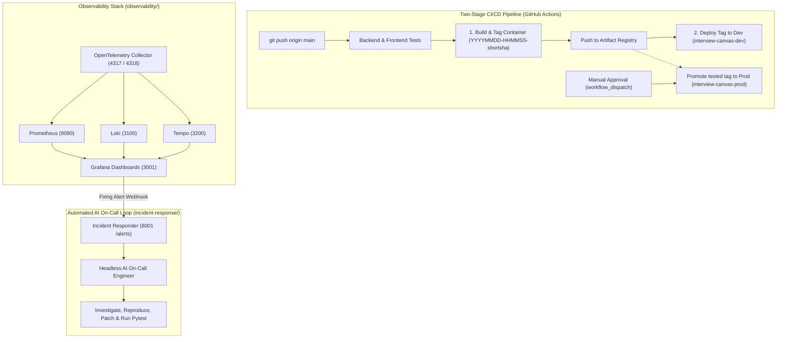

# Part 4: DevOps and Observability for an AI-Built App

> **Production Observability, Environment Segregation, and Autonomous AI Incident Response**  
> *Course: [AI Dev Tools Zoomcamp](https://github.com/DataTalksClub/ai-dev-tools-zoomcamp) by DataTalks.Club*

---

## Architecture Overview

Part 4 takes the **System Design Interview Platform (SDIP)** from a cloud-deployed prototype into a production-ready operational system:



---

## 1. Dev and Production Environments

To prevent regressions from impacting real users, two isolated environments are defined:
* **Dev (`interview-canvas-dev`)**: Deployed automatically on every push to `main` via [`.github/workflows/part4-deploy-dev.yml`](../.github/workflows/part4-deploy-dev.yml).
* **Prod (`interview-canvas-prod`)**: Promoted only after manual approval via [`.github/workflows/part4-promote-prod.yml`](../.github/workflows/part4-promote-prod.yml).

### Two-Stage Image Pipeline
1. **Build Once**: CI builds the container image and tags it with timestamp and short commit SHA (e.g. `20261004-194500-5b8422c`), then pushes it to Google Artifact Registry.
2. **Deploy Identical Tag**: Both Dev and Production pull this exact immutable image tag.

---

## 2. OpenTelemetry Instrumentation

The FastAPI backend is instrumented with the OpenTelemetry SDK in [`src/backend/telemetry.py`](./backend/src/backend/telemetry.py):

* **Standard Signals**:
  * **Traces**: Route spans, database operations, and WebSocket handlers.
  * **Metrics**: HTTP status counts and latency histograms.
* **Resource Attributes**:
  * `service.name`: `sdip-backend`
  * `deployment.environment.name`: `development` | `production` | `local`
  * `service.version`: container image tag / git SHA
* **Application Business Metrics**:
  * `sdip_sessions_created_total`: Counter for created interview sessions.
  * `sdip_active_participants`: UpDownCounter for real-time WebSocket participants.
  * `sdip_board_operations_total`: Counter for canvas drawing elements and operations.
  * `sdip_operation_failures_total`: Counter for canvas failure events and dropped payloads.

---

## 3. Running the Observability Stack

The observability infrastructure runs in an isolated Docker Compose project inside `observability/`:

```bash
cd observability
docker compose up -d
```

| Service | Host Port | Role |
| :--- | :--- | :--- |
| **OpenTelemetry Collector** | `4317` (gRPC), `4318` (HTTP), `8889` (Prometheus) | Ingests OTLP, routes signals |
| **Prometheus** | `9090` | Time-series metrics storage |
| **Loki** | `3100` | Log aggregation |
| **Tempo** | `3200` | Distributed traces |
| **Grafana** | `3001` (login: `admin` / `admin`) | Unified dashboards & alert rules |

Open [http://localhost:3001](http://localhost:3001) to view the pre-provisioned **System Design Canvas — Application Overview** dashboard with environment and version dropdown filters.

---

## 4. Automated AI On-Call Responder

When an alert triggers, an automated AI on-call engineer investigates the incident rather than waking up a human:

```
Grafana Alert Rule (5xx / Component Failures)
      │
      ▼ (Webhook POST /alerts)
incident-response/responder.py (Port 8001)
      │
      ▼
incident-response/agent_runner.py
      │
      ├── 1. Read alert labels and error summary
      ├── 2. Inspect code and run unit tests (uv run pytest)
      ├── 3. Discriminate false positives vs real bugs
      └── 4. Propose minimal fix, verify with tests, commit remediation
```

### Running the Responder Locally

1. Start the responder:
   ```bash
   cd incident-response
   uv --directory ../backend run python responder.py
   ```

2. Test with a synthetic alert:
   ```bash
   ./test_alert.sh 8001
   ```

3. Expected Output:
   ```json
   {
     "status": "received",
     "incident_id": "incident-20261004-194457",
     "agent_response": {
       "verdict": "False Positive",
       "explanation": "Alert is identified as a synthetic responder test notification; no application code changes required.",
       "last_line": "No action required: synthetic test notification verified."
     }
   }
   ```

---

## 5. Running the Complete System Locally

To run the application alongside the observability stack:

```bash
# Terminal 1: Start Observability Stack
cd observability
docker compose up -d

# Terminal 2: Run Application with OTel exporter pointing to collector
cd backend
OTEL_EXPORTER_OTLP_ENDPOINT="http://localhost:4317" uv run uvicorn backend.main:app --port 8000

# Terminal 3: Start AI Incident Responder
cd incident-response
uv --directory ../backend run python responder.py
```
